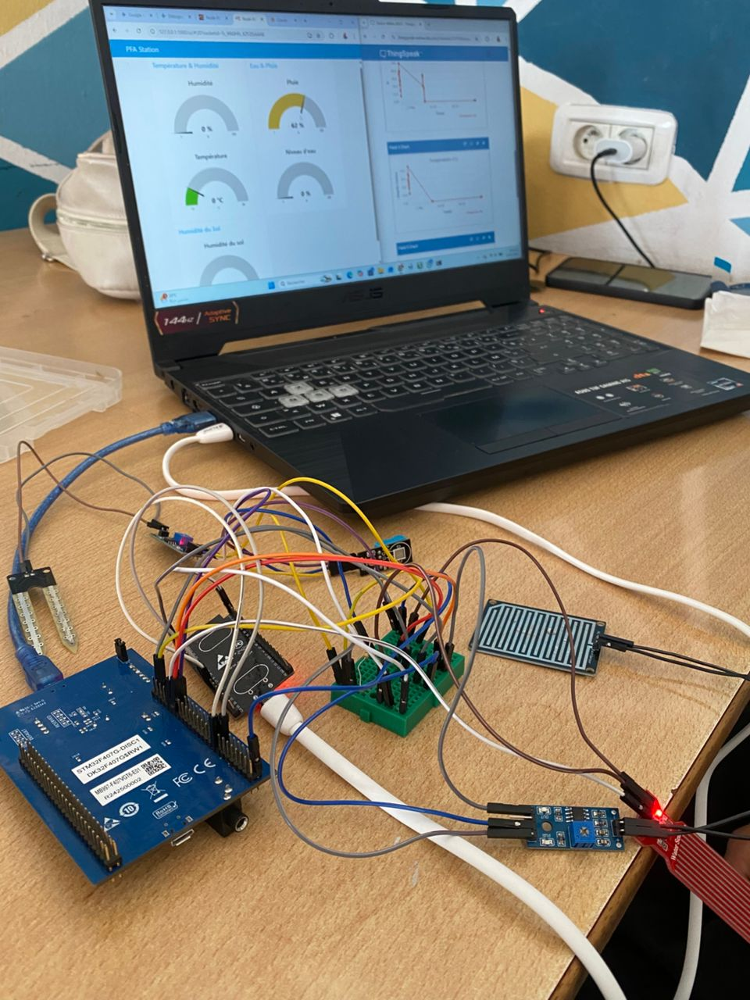
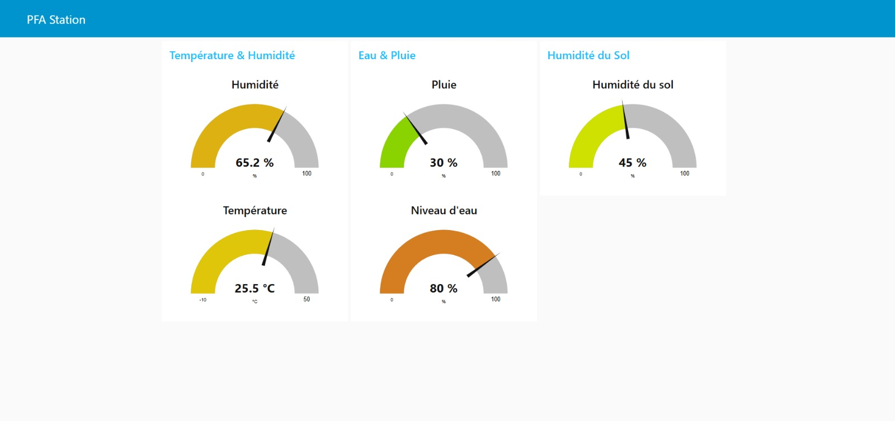
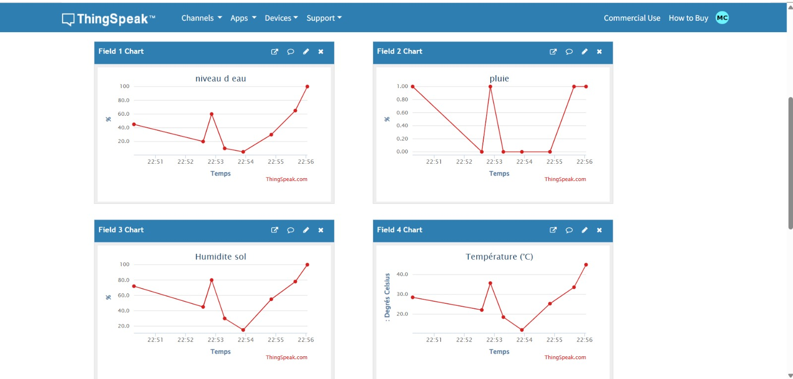

# Station Météo Intelligente — STM32F4

Station météo intelligente basée sur un microcontrôleur **STM32F4**, qui collecte des données environnementales via plusieurs capteurs et les transmet en temps réel vers un broker **MQTT** et vers **ThingSpeak**, grâce à un module WiFi **ESP32** piloté en commandes AT.

## Fonctionnalités

- Mesure du **niveau d'eau** (capteur analogique, PA0)
- Détection de **pluie** (capteur analogique, PA1)
- Mesure de l'**humidité du sol** (capteur analogique, PA3)
- Mesure de la **température** via capteur numérique **DS1621** (I2C)
- Transmission des données par **WiFi** vers un broker **MQTT**
- Envoi périodique des données vers **ThingSpeak** (dashboard cloud)

## Matériel utilisé

| Composant | Rôle | Connexion |
|---|---|---|
| STM32F4 | Microcontrôleur principal | — |
| ESP32 | Module WiFi (commandes AT) | USART3 (PB10 TX, PB11 RX) |
| DS1621 | Capteur de température numérique | I2C1 (PB6 SCL, PB7 SDA) |
| Capteur niveau d'eau | Entrée analogique | PA0 (ADC1) |
| Capteur de pluie | Entrée analogique | PA1 (ADC1) |
| Capteur humidité du sol | Entrée analogique | PA3 (ADC1) |

## Architecture logicielle

- **ADC + DMA** : acquisition en continu des 3 capteurs analogiques (eau, pluie, sol) sans bloquer le CPU.
- **I2C1** : lecture périodique (toutes les 2 secondes) de la température via le DS1621.
- **USART3 + ESP32 AT** : connexion WiFi, connexion au broker MQTT, publication des mesures.
- **Boucle principale** : orchestre les lectures capteurs, les publications MQTT (dès que l'ADC est prêt) et l'envoi ThingSpeak (toutes les 16 secondes).

## Topics MQTT publiés

| Topic | Donnée |
|---|---|
| `pfa/capteurs/niveau_eau` | Niveau d'eau (%) |
| `pfa/capteurs/pluie` | Intensité de pluie (%) |
| `pfa/capteurs/humidite_sol` | Humidité du sol (%) |
| `pfa/capteurs/temperature` | Température (°C) |

## Configuration avant utilisation

Avant de compiler, ouvrez `main.c` et remplacez les valeurs suivantes par les vôtres :

​```c
#define WIFI_SSID            "VOTRE_SSID_WIFI"
#define WIFI_PASSWORD        "VOTRE_MOT_DE_PASSE_WIFI"
#define MQTT_BROKER_IP       "IP_DU_BROKER_MQTT"
#define THINGSPEAK_API_KEY   "VOTRE_CLE_API_THINGSPEAK"
​```

>  Ne poussez jamais vos identifiants réels dans un dépôt public. Gardez ce fichier de configuration hors du suivi Git si possible (par exemple via un `config.h` séparé ajouté au `.gitignore`).

## Schéma de câblage



## Démonstration

Une vidéo de démonstration du fonctionnement de la station météo est disponible : [demo.mp4](demo.mp4)

## Dashboards de visualisation

Les données collectées peuvent être visualisées via Node-RED et ThingSpeak :





## Compilation

Ce projet est écrit en C pour STM32F4 et a été développé avec **Keil µVision (MDK-ARM)**.

Pour compiler et flasher le projet :
1. Ouvrez le projet dans **Keil µVision**.
2. Vérifiez que le **Device Pack STM32F4** correspondant à votre carte est bien installé (via le gestionnaire de packs, Pack Installer).
3. Compilez le projet avec **Build (F7)**.
4. Connectez votre carte STM32F4 (via ST-Link) et flashez le programme avec **Download (F8)**.
## Auteur

Projet réalisé par **CHAIMA M.**
